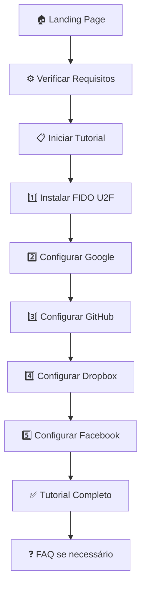

# ledger_with_yubiKey

# 🔐 Ledger → YubiKey Guide
### *Tutorial Interativo para Transformar sua Ledger em Token de Segurança*

<div align="center">
 você a usar sua carteira Ledger como uma chave de segurança FIDO U2F, funcionando similarmente a uma YubiKey para autenticação de dois fatores.

```
🎯 Objetivo: Maximizar a utilidade da sua Ledger além de criptomoedas
🛡️ Resultado: Segurança de nível hardware para todas suas contas online
💡 Diferencial: Tutorial passo-a-passo com interface moderna e interativa
```

## ✨ **Features Principais**

<table>
<tr>
<td width="50%">

### 🎨 **Interface Moderna**
- Design responsivo e limpo
- Animações suaves e intuitivas
- Paleta de cores profissional
- Compatível com mobile e desktop

### 📚 **Tutorial Completo**
- 5 etapas detalhadas e interativas
- Sistema de progresso visual
- Checkboxes para marcar conclusão
- Navegação por abas para diferentes serviços

</td>
<td width="50%">

### 🔧 **Funcionalidades**
- FAQ interativo expansível  
- Seção de troubleshooting
- Comparação Ledger vs YubiKey
- Lista de serviços suportados

### 📱 **Experiência do Usuário**
- Loading states e feedback visual
- Navegação intuitiva entre seções
- Conteúdo estruturado e escaneável
- Acessibilidade em mente

</td>
</tr>
</table>

## 🎬 **Demo & Preview**

### 🖥️ **Seções do Site**

```
┌─ 🏠 Landing Page
├─ ⚙️ Preparação & Requisitos  
├─ 📋 Tutorial Passo-a-Passo
│  ├─ 1️⃣ Instalar FIDO U2F App
│  ├─ 2️⃣ Configurar Google
│  ├─ 3️⃣ Configurar GitHub
│  ├─ 4️⃣ Configurar Dropbox
│  └─ 5️⃣ Configurar Facebook
├─ 🌐 Serviços Suportados
├─ ❓ FAQ & Troubleshooting
└─ ⚖️ Vantagens vs Limitações
```

### 🎯 **Serviços Compatíveis**

| Serviço | Status | Configuração |
|---------|--------|--------------|
| 🔍 **Google** | ✅ Totalmente Suportado | Via Google Account Security |
| 🐙 **GitHub** | ✅ Totalmente Suportado | Via Settings → Security |
| 📁 **Dropbox** | ✅ Totalmente Suportado | Via Two-step Verification |
| 👤 **Facebook** | ✅ Totalmente Suportado | Via Security Keys |
| 💰 **Binance** | ✅ Suportado | Via Account Security |
| 🪙 **Coinbase** | ✅ Suportado | Via Security Settings |

## 🛠️ **Tecnologias Utilizadas**

<div align="center">

| Frontend | Styling | Interatividade |
|----------|---------|----------------|
|  |  |  |

</div>

### 📦 **Estrutura do Projeto**

```
ledger-yubikey-guide/
├── 📄 index.html          # Página principal
├── 🎨 style.css           # Estilos e responsividade  
├── ⚡ app.js              # Lógica e interatividade
└── 📋 README.md           # Este arquivo
```

## 🚀 **Como Usar**

### **Método 1: Acesso Direto**
```bash
# Simplesmente abra o arquivo index.html no seu navegador
open index.html
```

### **Método 2: Servidor Local**
```bash
# Usando Python (recomendado)
python -m http.server 8000

# Usando Node.js
npx serve .

# Usando PHP
php -S localhost:8000
```

### **Método 3: Live Server (VS Code)**
1. Instale a extensão "Live Server"
2. Clique direito em `index.html`
3. Selecione "Open with Live Server"

## 🎯 **Flow da Aplicação**



## 🔧 **Customização**

### **Modificar Dados**
```javascript
// Em app.js - Adicionar novos serviços
const newService = {
  name: "Novo Serviço",
  status: "Suportado", 
  icon: "🆕"
};
appData.supported_services.push(newService);
```

### **Alterar Cores**
```css
/* Em style.css - Personalizar paleta */
:root {
  --color-primary: #your-color;
  --color-secondary: #your-color;
  --color-accent: #your-color;
}
```

## 💡 **Recursos Educacionais**

### **📖 O que você aprenderá:**
- ✅ Como FIDO U2F funciona
- ✅ Diferença entre FIDO U2F e Security Key app
- ✅ Vantagens e limitações da Ledger vs YubiKey
- ✅ Configuração passo-a-passo para 5+ serviços
- ✅ Troubleshooting de problemas comuns
- ✅ Backup e recuperação de credenciais

### **🎓 Público-alvo:**
- 👥 Usuários de Ledger que querem mais segurança
- 🔒 Entusiastas de segurança cibernética  
- 💻 Desenvolvedores que usam 2FA
- 🏢 Equipes que precisam de autenticação forte

## 🤝 **Como Contribuir**

```bash
# 1. Fork este repositório
# 2. Crie uma branch para sua feature
git checkout -b feature/nova-funcionalidade

# 3. Commit suas mudanças
git commit -m "✨ Adiciona nova funcionalidade"

# 4. Push para a branch
git push origin feature/nova-funcionalidade

# 5. Abra um Pull Request
```

### **🎯 Áreas para Contribuição:**
- 📱 Melhorias na responsividade mobile
- 🌐 Tradução para outros idiomas  
- ⚡ Otimizações de performance
- 🎨 Melhorias no design/UX
- 📚 Adição de novos serviços
- 🐛 Correção de bugs

## 📊 **Estatísticas do Projeto**

<div align="center">

| 📁 Arquivos | 📏 Linhas de Código | 🎨 Componentes | 📱 Responsivo |
|-------------|-------------------|-----------------|---------------|
| 3 | ~800 | 15+ | ✅ Sim |

</div>

## 📄 **Licença**

Este projeto está sob a licença MIT. Veja o arquivo `LICENSE` para mais detalhes.

***

<div align="center">

### **🔥 Gostou do projeto?**

**⭐ Deixe uma estrela!** -  **🐛 Reporte bugs** -  **💡 Sugira melhorias**

***

**Feito com ❤️ para a comunidade cripto e segurança digital**

</div>

### 🏷️ **Tags**
`#ledger` `#yubikey` `#fido-u2f` `#2fa` `#security` `#authentication` `#hardware-wallet` `#tutorial` `#interactive` `#web-app`
